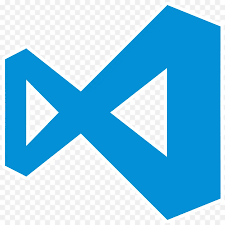

<h1 align="center">Hi there, I'm Otchugash</h1>
<h3 align="center">Golang Backend Developer</h3>

- 🌱 I’m currently learning **Go, Web**

- 📫 Studying at Information systems and technologies, RTU MIREA, additionally studying at School21 by Sber

- 🌍 I speak Russian (native), English (B2)

<picture>
  
</picture>

### Connect with me:

  

## 🛠️ Stack
**Languages:**

  
  
  
  

**Databases:**

  
  
  
  

**Tools:**

  
  
  
  
  
  

